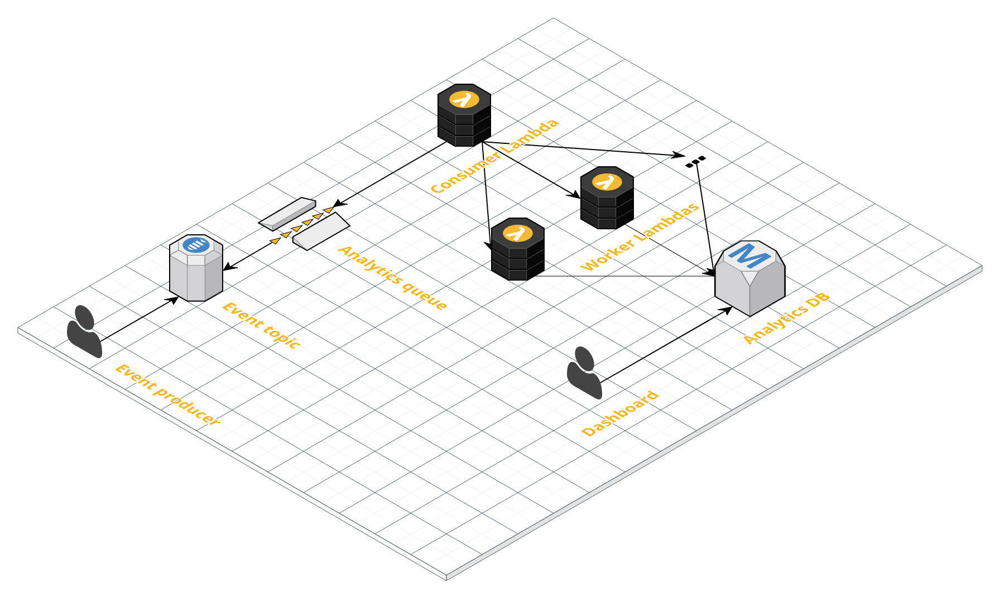

# A Simple Lambda/Terraform analytics service

Sets up (a) a general messaging topic in which to hook up additional event listeners and (b) a little analytics service that feeds events into a database that can be further used by a dashboard frontend like Superset or Metadash.

Features
- Terraform-managed Lambdas (inspired by [this blog post](https://medium.com/build-acl/aws-lambda-deployment-with-terraform-24d36cc86533))
- mocking AWS with [moto](https://github.com/spulec/moto) for local tests
- pipenv to keep development dependencies out of deployed Lambda zips



## Dependencies

- AWS Command Line Interface
- [invoke](https://github.com/pyinvoke/invoke)
- pip-env >= 8.3.0
- terraform
- [awslogs](https://github.com/jorgebastida/awslogs) (optional)

## Set up infrastructure

First set up the shared environment:

1. Create a S3 bucket for storing [Terraform remote state](https://www.terraform.io/docs/state/remote.html).
2. Move to the shared environment directory: `cd infrastructure/shared`.
3. Create a `terraform.tfvars` [secret variables file](https://www.terraform.io/intro/getting-started/variables.html#from-a-file). Check [`infrastructure/shared/terraform.tfvars.sample`](infrastructure/shared/terraform.tfvars.sample) for an example. These files should naturally be kept outside version control.
4. Run `terraform init` to set up a Terraform working directory. You'll be prompted for the name of the remote state bucket created in step 1. Alternatively you can define the bucket with a `-backend-config='bucket=[BUCKET NAME]'` argument.
5. Run `terraform apply` to build the infra.

Now with the shared infra set up, you can provision individual environments. For example to set up `dev`:

1. First build the Lambda functions: `inv build`.
2. Navigate to the environment directory: e.g. `cd infrastructure/dev`.
3. Repeat the above steps 3-5 to set up the environment-specific resources.
4. Initialize the database: `inv init-db --env dev`.

And we're set! Replace `dev` with `staging`, `prod`, etc to set up additional environments.

## Tasks

Various management tasks are defined in [`tasks.py`](tasks.py). The default environment (`--env`) and AWS profile can be configured in [`invoke.yaml`](invoke.yaml).

Run `inv --list` to see a summary of all available tasks. The most important tasks are as follows:

### Build

`inv build --func [FUNCTION]`: Build a function. Builds all if `--func` is not specified.

### Invoke

`inv invoke [FUNCTION] --env [ENV] --payload [PAYLOAD]`: Invoke a deployed function.

Example:
```bash
inv invoke analytics_worker --env staging --payload '[{"event_id": 12}]'
```

### Update

`inv update [FUNCTION] --env [ENV]`: Quickly update function code without rebuilding dependencies.

## Limitations

Due to [a bug in the Terraform Postgres provider](https://github.com/terraform-providers/terraform-provider-postgresql/issues/16), changing db password variables doesn't actually result in a password update. As a workaround you can manually `DROP ROLE ...` via `psql` and re-apply terraform.

## TODO

- improve docs
- cloudwatch cron
- testing
- local invocation
